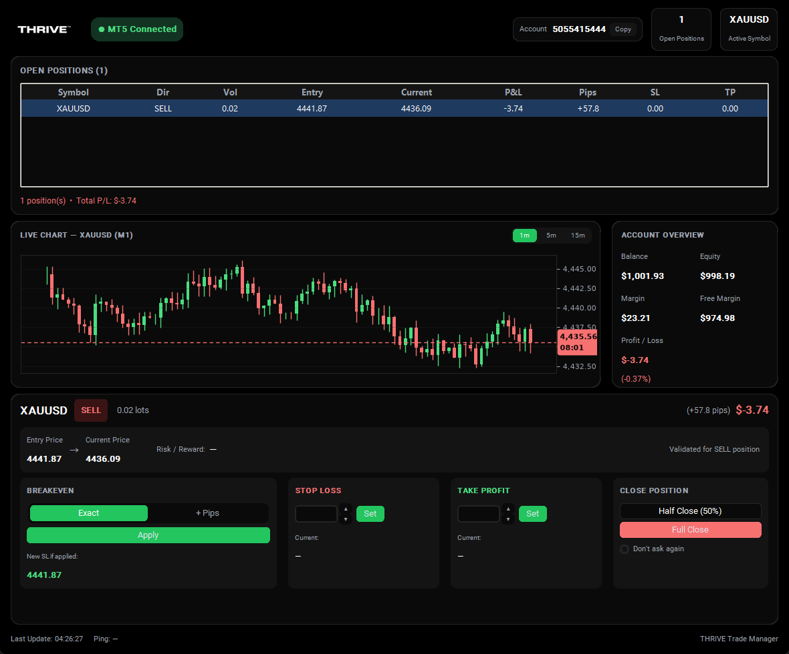
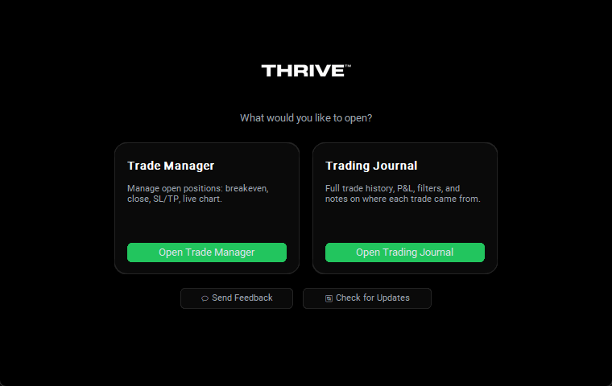
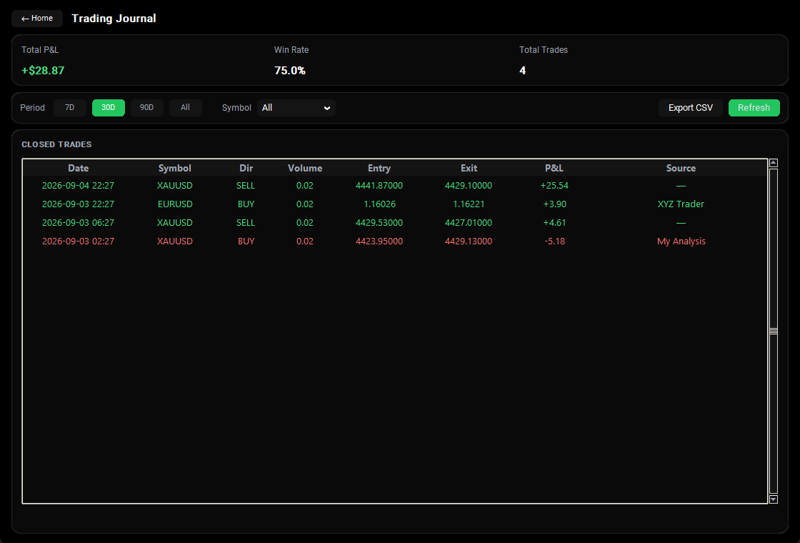

# THRIVE Trade Manager

**A free, one-click trade management and journaling tool for MetaTrader 5.** Move your stop loss to breakeven, close half a position, or set SL/TP — all in one click instead of hunting through MT5's own menus. Then see every closed trade automatically laid out with your win rate and P&L, no spreadsheet required.



## ⬇ Download

**[Download the latest version](https://github.com/Shani0017/Thrive-Trading-Manager/releases/latest)** — click the `.exe` file under "Assets" on that page.

No installation, no setup — just open [MetaTrader 5](https://www.metatrader5.com/) and log into your account first, then double-click the downloaded file. That's it.

## 🔒 Your privacy, in plain terms

- **We collect nothing.** This app has no server, no analytics, no telemetry. Nobody but you ever sees your trades, balance, or account number.
- **No account to create, no login for this app.** It reads directly from your own MetaTrader 5 terminal, which is already open and logged into *your* broker account — this app never asks for a username, password, or API key of its own.
- **Nothing leaves your computer.** All your data — the trade history it shows you, the notes you add — stays on your machine. The only thing sent over the internet is a check for whether a newer version of the app exists (a public, anonymous request with no personal data attached).

## Why traders use it

Managing a live trade in the standard MT5 terminal means several clicks through modify-order dialogs just to move your stop to breakeven. Reviewing your trading history means scrolling through MT5's own history tab with no notes, no win-rate summary, and no way to track *why* you took a trade. THRIVE Trade Manager fixes both:

- **Act faster on live trades** — breakeven, half-close, full-close, or a custom SL/TP in one click, with a live chart right next to the position so you can see price action while you decide.
- **Actually learn from your history** — every closed trade, automatically reconstructed from MT5's own records, with running P&L and win-rate, filterable by date range and symbol.
- **Remember your own reasoning** — tag each trade with where the idea came from ("My Analysis," a signal provider, a YouTube setup) so patterns in what actually works for you become visible over time.

## What it does

Launches to a home screen with two tools:



### Trade Manager

Manage open MT5 positions with a single click on whichever one you select from the live table:

- **Breakeven** — move SL to your exact entry price, or entry + a custom pip buffer
- **Half Close / Full Close** — close 50% or 100% of a position at market
- **Custom Stop Loss / Take Profit** — type a price or use the +/- steppers (which know which direction is valid for a BUY vs. a SELL)
- **Live candlestick chart** with 1m/5m/15m timeframes, right next to the position you're managing

Never opens a trade and never acts on its own — every single action happens only when you click a button, and confirms before it closes anything (unless you turn that off).

### Trading Journal



Full closed-trade history pulled straight from MT5's own deal records (real data, reconstructed by pairing each position's entry and exit deals — nothing fabricated or estimated):

- Running **P&L and win-rate** summary
- **Date-range and symbol filters** (7 days, 30 days, 90 days, or all-time)
- A **Source** note per trade — click any row to tag it with your own analysis, a signal provider's name, a YouTube channel, or anything else, so you can later see which sources actually make you money
- **Export to CSV** — opens directly in Excel or Google Sheets (File → Import) if you want to do your own analysis

## Feedback and updates

There's a **Send Feedback** button on the home screen for bug reports and feature ideas — takes under a minute, no account required. The app also checks for new versions automatically and lets you know if one's available; it never installs anything on its own, you're always the one who decides when to update.

---

## For Developers

### Running it from source

```bash
pip install -r requirements.txt
python main.py
```

Requires MetaTrader 5 to already be open and logged into your account — the
app attaches to that running terminal, it does not log in on its own.

### Building the distributable .exe

```bash
build_exe.bat
```

Produces a single file at `dist\THRIVE Trade Manager.exe`.

### Publishing a new release

```bash
publish_release.bat
```

Runs the tests, builds the exe, generates release notes from the commit
history since the last tag, pushes to GitHub, and creates a new release
(tagged to match `APP_VERSION` in `update_check.py`) with the exe attached
— all in one step. Bump `APP_VERSION` before running it.

### Running tests

```bash
pytest -v
```
